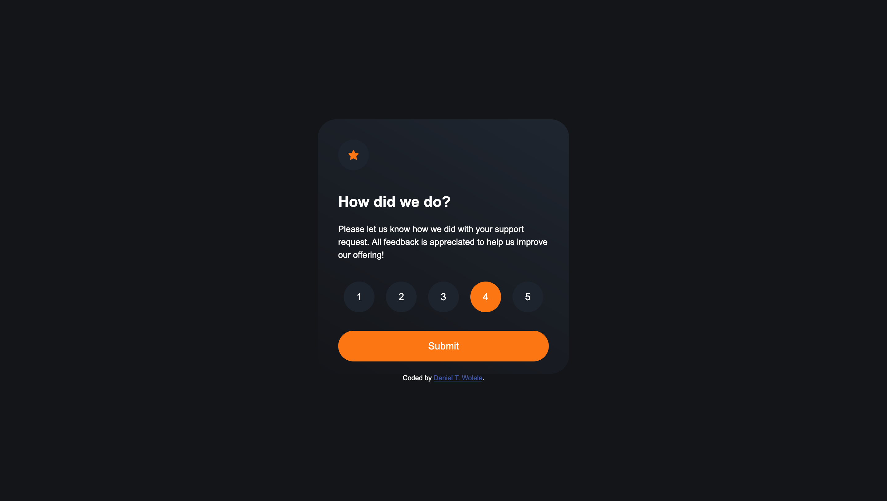
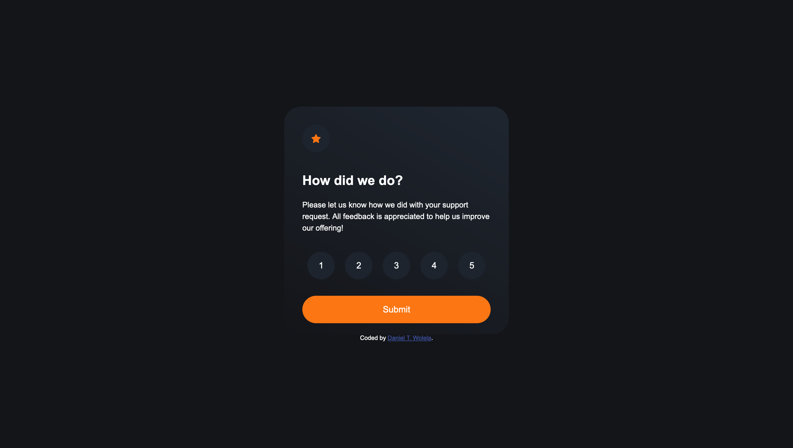
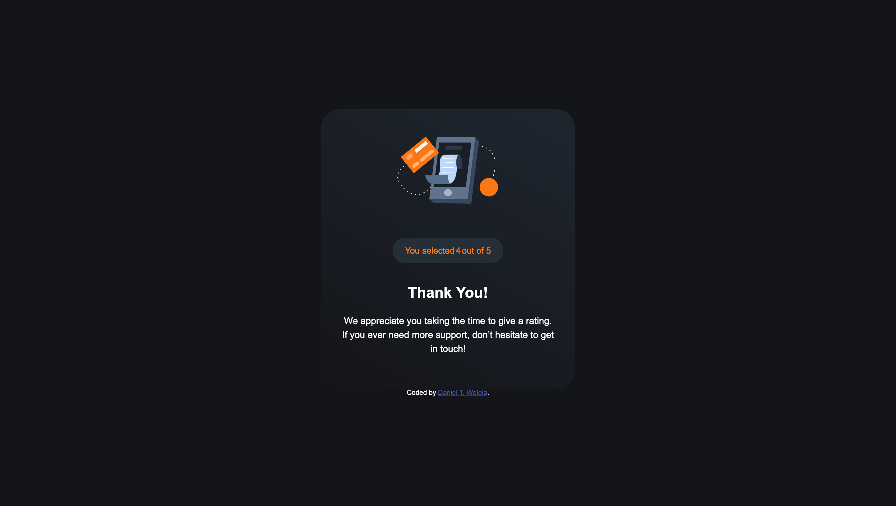
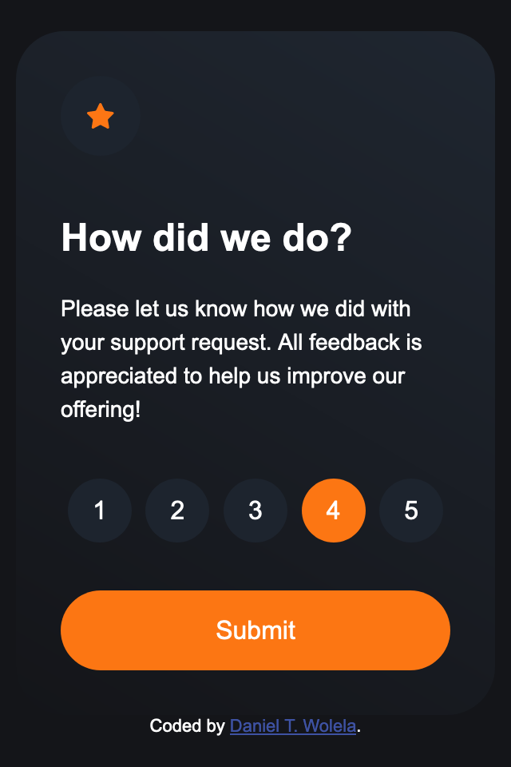
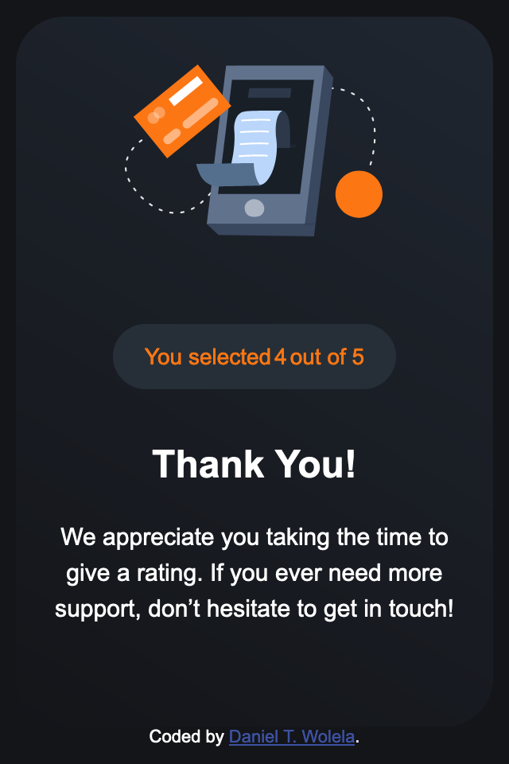

# Interactive rating component solution

This is a small Interactive rating component solution that is used to rate a product.
Feel free to use it in your project.

## Table of contents

- [Overview](#overview)
  - [The challenge](#the-challenge)
  - [Screenshot](#screenshot)
  - [Links](#links)
  - [Built with](#built-with)

## Overview

### The challenge

Users should be able to:

- View the optimal layout for the app depending on their device's screen size
- See hover states for all interactive elements on the page
- Select and submit a number rating
- See the "Thank you" card state after submitting a rating

### Screenshot

### Links

- Full code: [Github](https://github.com/DanielTeshager/interactive-rating-component)
- Live Site: [Tiny Rating Component](https://zesty-pie-462302.netlify.app/)

### Built with

- CSS custom properties
- Flexbox
- Mobile-first workflow
